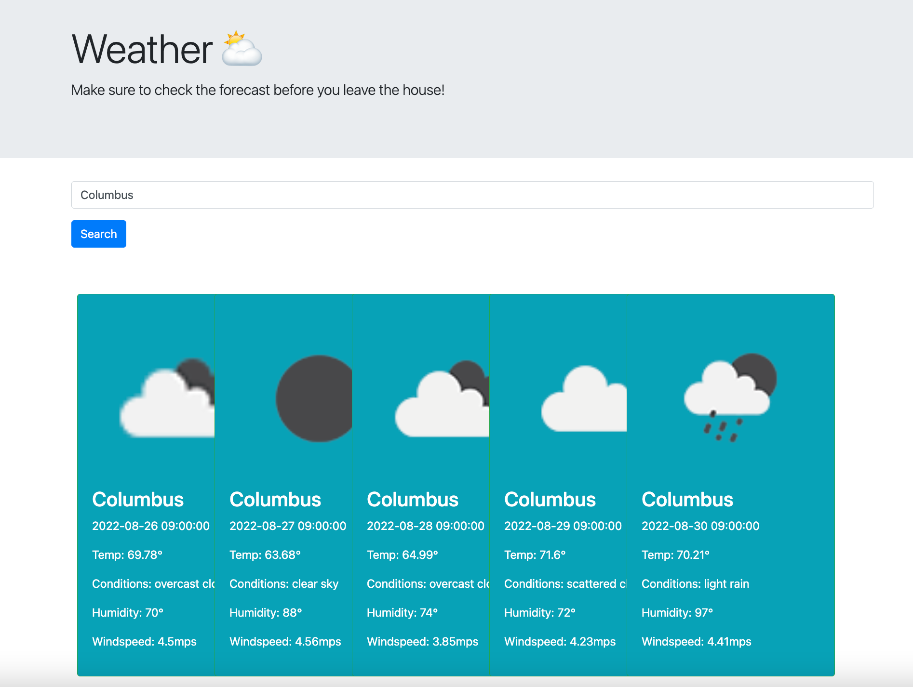

# <Weather-Forecast>

## Weather Forecast

## Table of Contents

- [Description](#description)
- [Installation](#installation)
- [User Story](#user-story)
- [Acceptance Criteria](#acceptance-criteria)
- [Mock Up](#mock-up)
- [Submission](#submission)
- [Credits](#credits)
- [License](#license)

## Description

<ul>
<li>
The motivation behind this project was to implement a weather forecast site, that uses a third-party weather API.
</li>
<li>
Through the OpenWeather API, we're able to select different data points to display. 
</li>
<li>
This project is a very easy tool that people can use in their every day lives.
</li>
</ul>

## Installation

<ol>
<li>
In order to begin this project, we must first have a suitable code viewer, such as VSCode. From there, we will need a base html file, and link our javascript, jquery, bootstrap, and css libraries to it.
</li>
<li>
Next we open a browser that supports dev tools like Google Chrome or Mozilla Firefox.
</li>
<li>
After we have our broswer and codeviewer open, we can begin to run our code and functions to ensure that we are getting the desired results.
</li>
<li>
After we finish our code, we eliminate any reduncies in the code to make it more viewable by other developers - and run our last few spot checks in various browsers to ensure the fully-deployed page is behaving correctly.
</li>
</ol>

## USER STORY

AS A traveler

I WANT to see the weather outlook for multiple cities

SO THAT I can plan a trip accordingly

## ACCEPTANCE CRITERIA

GIVEN a weather dashboard with form inputs

WHEN I search for a city

THEN I am presented with current and future conditions for that city and that city is added to the search history

WHEN I view current weather conditions for that city

THEN I am presented with the city name, the date, an icon representation of weather conditions, the temperature, the humidity, the wind speed, and the UV index

WHEN I view the UV index

THEN I am presented with a color that indicates whether the conditions are favorable, moderate, or severe

WHEN I view future weather conditions for that city

THEN I am presented with a 5-day forecast that displays the date, an icon representation of weather conditions, the temperature, the wind speed, and the humidity

WHEN I click on a city in the search history

THEN I am again presented with current and future conditions for that city

## MOCK UP

## SUBMISSION

The fully deployed webpage for this project can be found by using the GitHub Pages link below:

https://shahidhashmi1.github.io/...

The codebase and supporting files can be found by using the GitHub repository link below:

https://github.com/ShahidHashmi1/...

## Credits

The collaborators on this project included cohort member, Nick Mason, cohort member, Dimitra Anastaspoulos, tutor, Natasha Mann, and TA Michael Kotte.

Primarily using course documentation and referencing the [OpenWeather][1] API documentation.

[1]: https://openweathermap.org/forecast5#limit "OpenWeather"

## License

MIT License

Copyright (c) 2022 ShahidHashmi1

Permission is hereby granted, free of charge, to any person obtaining a copy
of this software and associated documentation files (the "Software"), to deal
in the Software without restriction, including without limitation the rights
to use, copy, modify, merge, publish, distribute, sublicense, and/or sell
copies of the Software, and to permit persons to whom the Software is
furnished to do so, subject to the following conditions:

The above copyright notice and this permission notice shall be included in all
copies or substantial portions of the Software.

THE SOFTWARE IS PROVIDED "AS IS", WITHOUT WARRANTY OF ANY KIND, EXPRESS OR
IMPLIED, INCLUDING BUT NOT LIMITED TO THE WARRANTIES OF MERCHANTABILITY,
FITNESS FOR A PARTICULAR PURPOSE AND NONINFRINGEMENT. IN NO EVENT SHALL THE
AUTHORS OR COPYRIGHT HOLDERS BE LIABLE FOR ANY CLAIM, DAMAGES OR OTHER
LIABILITY, WHETHER IN AN ACTION OF CONTRACT, TORT OR OTHERWISE, ARISING FROM,
OUT OF OR IN CONNECTION WITH THE SOFTWARE OR THE USE OR OTHER DEALINGS IN THE
SOFTWARE.
